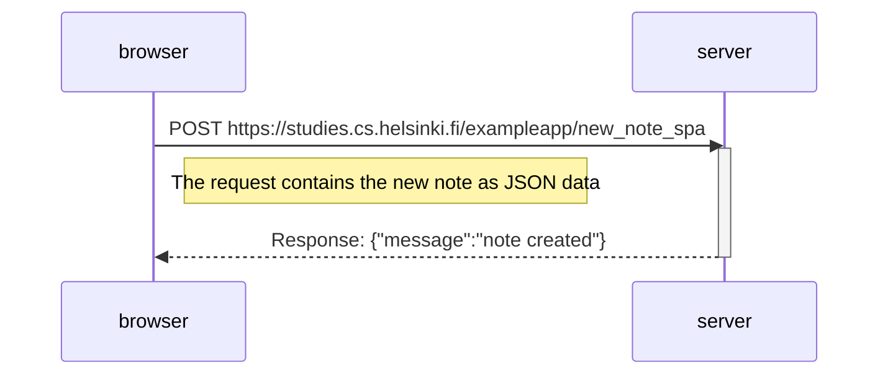

```mermaid
sequenceDiagram
    participant browser
    participant server

    browser->>server: POST https://studies.cs.helsinki.fi/exampleapp/new_note_spa
    activate server
    Note right of browser: The request contains the new note as JSON data
    server-->>browser:  Response: {"message":"note created"}
    deactivate server
```
